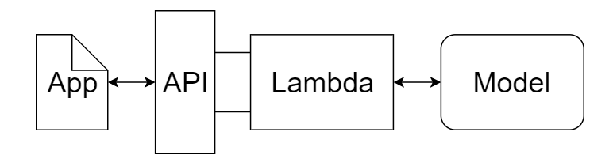
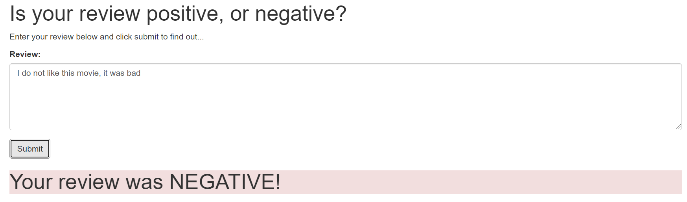
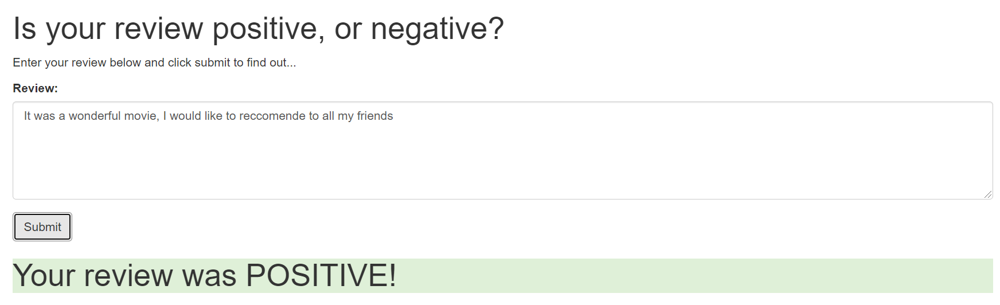
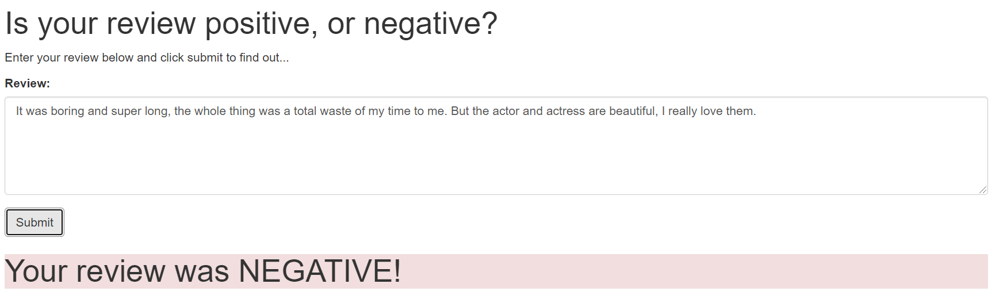
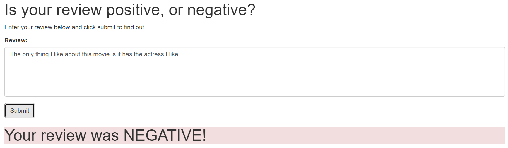

# Udacity-Deploy-a-sentiment-analysis
Udacity deep learning nanodegree project 5

### Table of contents

1. [Software and Service used](#Service)
2. [Project Inspiration](#Inspiration)
3. [File Descriptions](#files)
4. [Data Insights](#Insights)
5. [Licensing, Authors, and Acknowledgements](#licensing)

## Software and service used 

Python version 3.0.
Amazon Web Service to train, evaluate and deploy the web app. 

## Project Inspiration

Get a sense of how to deploy a machine learning model using AWS Sagemaker, including upload train, validation and test data to S3; develope and train, validate and test RNN, then do the following as this picture indicate to deploy my web app that can judge a movie review is positive or negative. 

## File Descriptions 

*__Deploy_a_sentiment_analysis.ipynb__* : Jupyter notebook containing all the codes and results

*__report.html__* : notebbok in html format

*__train.py__* : model file

*__predict.py__* : predict fucntion file

*__index.html__* : web app 

## Insights

After deploy my web app, I generated few reviews and test it, the following are the results. 

The intersting one is the last two, I said 'this movie is long and boring, but I like ...' and 'the only thing I like about this movie is it has the actress I like', the web app thinks both are NEGATIVE review and they do. Even tho I use plain and positive words like 'like', 'actress'. It feels like this web app understands my feeling, which feels funny in a way. Anyways, I only typed few reviews and there are room for improving, we could use LSTM RNN, etc.... 

## Licensing, Authors, Acknowledgements

Data: [IMDb data](http://ai.stanford.edu/~amaas/data/sentiment/)

Authors: [To the Notebook](https://github.com/boniu86/Deploy_a_sentiment_analysis/blob/main/Deploy_a_sentiment_analysis.ipynb)

